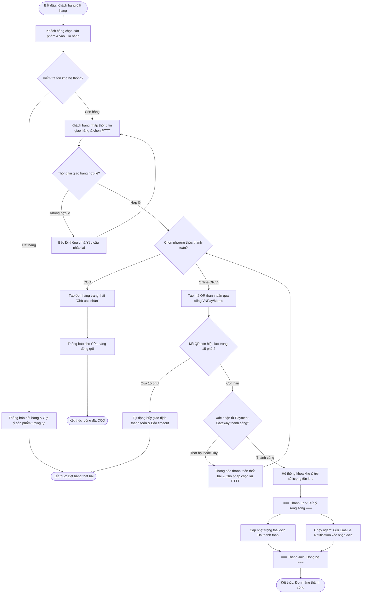

# BÁO CÁO PHÂN TÍCH VÀ THIẾT KẾ HỆ THỐNG - MINI PROJECT TỔNG HỢP (SESSION 11)

> 👤 **Học viên:** Đỗ Hoàng Sơn | **Mã SV:** PTIT-HCM-066
> 🏫 **Môn học:** IT105-K25-Phan-tich-thi-t-k-h-th-ng

---

## 📊 Sơ đồ thiết kế hệ thống (Activity Diagram)

> 💡 *Sơ đồ dưới đây được render tự động trực tiếp trên GitHub bằng Mermaid. Bạn cũng có thể tải file **`bt1.drawio`** trong repository này để mở và chỉnh sửa trực tiếp trên [Draw.io (diagrams.net)](https://app.diagrams.net).* 

---

## Nhiệm vụ 1: Tổng quan Bài toán Mini Project và Phân tích Yêu cầu Hệ thống (SRS)

Bài tập Mini Project tổng hợp Session 11 yêu cầu kết nối và vận dụng toàn bộ kiến thức đã tích lũy từ Session 01 đến Session 10, bao gồm: Thu thập yêu cầu (SRS), Thiết kế Sơ đồ Luồng Công việc (Activity Diagram), Mô hình hóa Chức năng (Use Case Diagram), Thiết kế Cấu trúc Động (Sequence Diagram) và Lớp Đối tượng (Class Diagram).

Hệ thống được chọn để phân tích trong bài làm này là Hệ thống Quản lý Thương mại Điện tử và Thanh toán Trực tuyến (E-Commerce & Online Payment Subsystem). Đây là phân hệ có độ phức tạp cao, đòi hỏi xử lý đồng thời (Concurrency), kiểm soát trạng thái giao dịch an toàn và tối ưu trải nghiệm người dùng (UX).

- Yêu cầu chức năng (FR): Hỗ trợ duyệt hàng, kiểm tra tồn kho theo thời gian thực, đặt hàng, tích hợp cổng thanh toán trực tuyến (VNPay/Momo) và theo dõi trạng thái đơn hàng.
- Yêu cầu phi chức năng (NFR): Thời gian phản hồi API < 200ms, đảm bảo tính toàn vẹn dữ liệu tài chính (ACID Compliance), xử lý nghẽn kho khi có nhiều người mua cùng lúc (Race Condition), bảo mật thông tin thanh toán theo chuẩn PCI-DSS.
- Stakeholders chính: Khách hàng (Customer), Quản trị viên (Admin), Nhân viên Bán hàng (Store Staff), Cổng thanh toán (Payment Gateway API) và Hệ thống Vận chuyển (Third-party Logistics API).

## Nhiệm vụ 2: Thiết kế Sơ đồ Activity Diagram Quy trình Xử lý Đơn hàng và Thanh toán

Sơ đồ Activity Diagram chuẩn TO-BE được xây dựng nhằm mô tả chính xác luồng di chuyển dữ liệu và xử lý quyết định từ lúc khách hàng bắt đầu chọn hàng cho tới khi đơn hàng hoàn tất.

Mô hình áp dụng các thành phần UML chuẩn: Decision Nodes (hình thoi) cho các điểm kiểm tra điều kiện, Fork/Join Bars (thanh đậm xử lý song song) để tách luồng cập nhật cơ sở dữ liệu và gửi thông báo tự động.

- Luồng kiểm tra tồn kho (Check Stock): Đảm bảo trước khi thanh toán, số lượng sản phẩm trong kho vẫn còn đủ để phục vụ đơn hàng.
- Luồng kiểm tra thời gian hiệu lực QR Code (15 phút): Giảm thiểu tình trạng treo đơn hàng và chiếm giữ tồn kho ảo khi khách hàng không hoàn tất thanh toán.
- Luồng rẽ nhánh Fork/Join: Sau khi thanh toán thành công, hệ thống tách thành 2 nhánh chạy song song (Cập nhật trạng thái đơn hàng + Gửi Email/Notification xác nhận) giúp phản hồi giao diện tức thì cho người dùng mà không bị nghẽn I/O.

## Nhiệm vụ 3: Bảng Đặc tả Chi tiết Quy trình Nghiệp vụ (Activity & Use Case Specification)

Dưới đây là bảng đặc tả từng bước thực thi trong quy trình xử lý đơn hàng và thanh toán trực tuyến, đảm bảo tính minh bạch cho đội ngũ lập trình viên (Developers) và kiểm thử (Testers):

| Bước | Tác nhân / Thực thể | Hành động thực hiện | Điều kiện tiên quyết / Kết quả mong đợi |
| --- | --- | --- | --- |
| 1 | Khách hàng | Lựa chọn danh mục sản phẩm và bấm 'Thêm vào giỏ hàng' | Sản phẩm tồn tại trên hệ thống và active |
| 2 | Hệ thống | Kiểm tra tồn kho thời gian thực (Real-time Inventory Check) | Nếu hết hàng: Báo lỗi và gợi ý sản phẩm thay thế. Nếu còn: Cho phép tiếp tục |
| 3 | Khách hàng | Nhập địa chỉ giao hàng, số điện thoại và chọn Phương thức thanh toán | Yêu cầu validate chính xác định dạng SĐT và địa chỉ |
| 4a | Hệ thống (Luồng COD) | Tạo đơn hàng trạng thái 'Chờ xác nhận', chuyển thông tin cho nhân viên đóng gói | Đơn hàng lưu thành công vào CSDL, phát sự kiện notify cho nhân viên kho |
| 4b | Hệ thống (Luồng Online) | Gọi API Payment Gateway tạo mã QR Code thanh toán có TTL = 15 phút | Hiển thị mã QR kèm đồng hồ đếm ngược trên giao diện |
| 5 | Khách hàng & Gateway | Khách quét mã QR và thực hiện xác thực sinh trắc học/OTP trên app Ngân hàng | Payment Gateway xử lý trừ tiền tài khoản ngân hàng của khách |
| 6 | Hệ thống | Nhận Webhook callback xác nhận giao dịch thành công từ Payment Gateway | Xác minh chữ ký bảo mật (Checksum/HMAC SHA256) tránh giả mạo request |
| 7 | Hệ thống (Thanh Fork) | Kích hoạt xử lý song song 2 nhánh: 1. Cập nhật trạng thái đơn 'Đã thanh toán', 2. Gửi Email biên lai | Tối ưu hóa performance, giảm latency màn hình phản hồi |
| 8 | Hệ thống (Thanh Join) | Đồng bộ hai luồng xử lý và hiển thị thông báo thành công cho Khách hàng | Hoàn tất quy trình đặt hàng an toàn |

## Nhiệm vụ 4: Phân tích Các Bẫy Dữ liệu (Edge Cases) và Giải pháp Thiết kế Kỹ thuật

Trong các hệ thống thực tế, quy trình thanh toán luôn đối mặt với nhiều nguy cơ mất an toàn dữ liệu và sai lệch số lượng tồn kho. Việc phân tích trước các Edge Cases giúp hệ thống vận hành ổn định và tin cậy.

- Xử lý Đương thời (Race Condition/Concurrency): Khi có 100 người cùng bấm mua 1 sản phẩm cuối cùng trong kho tại cùng 1 giây. Giải pháp: Sử dụng cơ chế Pessimistic Locking hoặc Redis Distributed Lock khi người dùng chuyển sang bước thanh toán.
- Thanh toán thành công nhưng đứt kết nối mạng (Network Timeout/Dropped Webhook): Giải pháp: Thiết lập tiến trình Worker chạy định kỳ (Cronjob Reconciliation) gọi API Query Transaction Status từ phía Ngân hàng để đối soát bù.
- Khách hàng quét QR nhưng hủy giữa chừng hoặc quá 15 phút không chuyển khoản: Giải pháp: Cài đặt TTL (Time-To-Live) cho mã QR trên Redis. Khi quá hạn, hệ thống tự động giải phóng giữ kho (Release Stock Hold) cho người mua khác.

---

## 📁 Danh sách tệp tin nộp bài trong Repository
- 📝 `bt1.docx`: Báo cáo tài liệu phân tích nghiệp vụ hoàn chỉnh.
- 🎨 `bt1.drawio`: File thiết kế sơ đồ chuẩn theo quy định đề bài (mở trực tiếp bằng [Draw.io](https://app.diagrams.net) hoặc Lucidchart).
